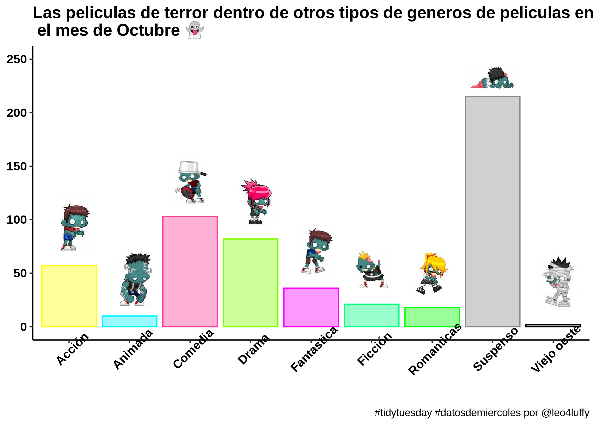
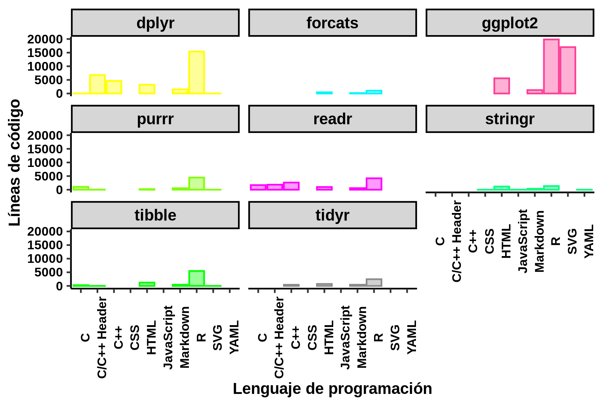
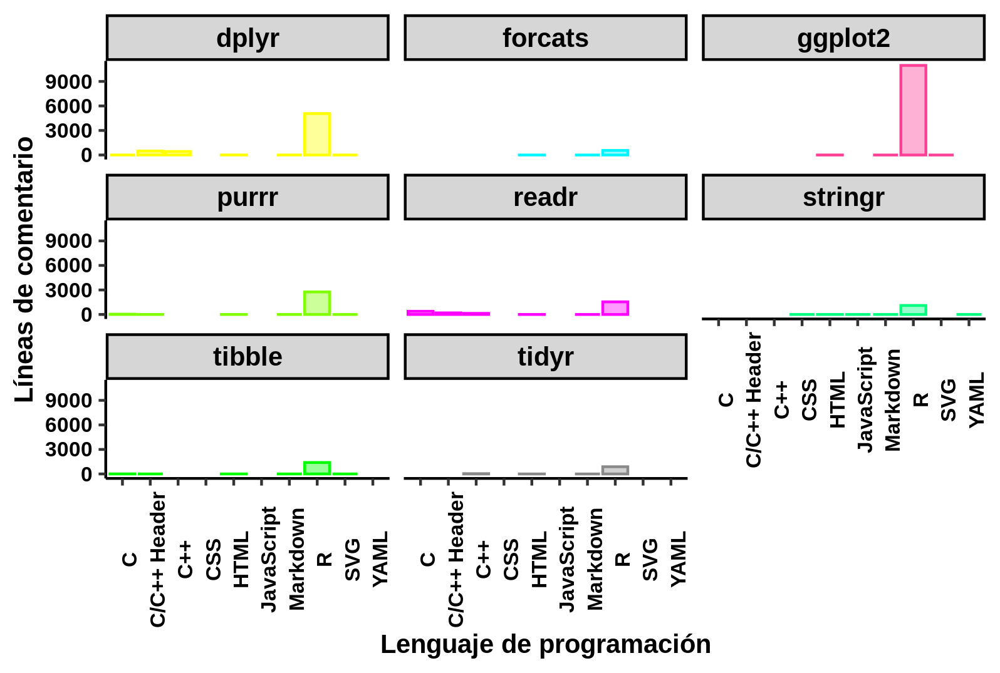

<b>Algunos enlaces de interés:</b> 
:tongue: <a href="#"><a href="https://leo4luffy.github.io/">Mi sitio web</a></a> |
:mailbox_with_mail: <a href="mailto:jollopezma@unal.edu.co">Mi correo electrónico</a>
  

## Conjunto de datos sobre anime
El conjunto de datos y la información del mismo lo puedes encontrar [aquí](https://github.com/rfordatascience/tidytuesday/tree/master/data/2019/2019-04-23).

## Peliculas de horror

El conjunto de datos y la información del mismo lo puedes encontrar [aquí](https://github.com/rfordatascience/tidytuesday/tree/master/data/2019/2019-10-22).

## Paquetes disponibles en el CRAN

El conjunto de datos y la información del mismo lo puedes encontrar [aquí](https://github.com/rfordatascience/tidytuesday/tree/master/data/2019/2019-11-12).

